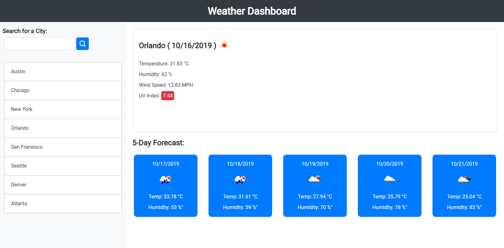

# weather-dashboard
Assignment 6 for University of Toronto coding bootcamp.
Live Demo: https://andydurette.github.io/weather-dashboard/ 

This assignment focused on using API data from openweathermap, the data was received and handled by jQuery and AJAX.

